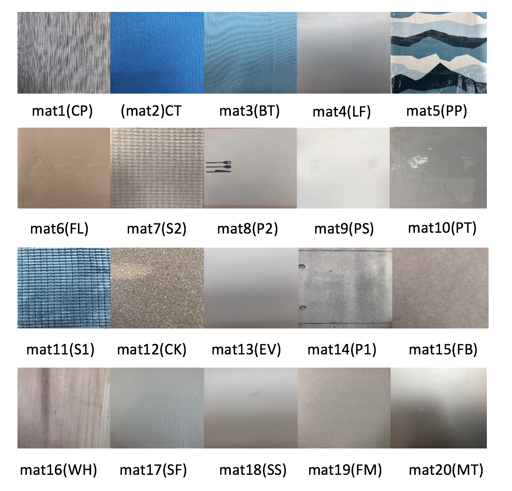

# BioTac_slide_20_50
This repository contains tactile data and material description for texture classification, supplementary to the paper "Supervised  Autoencoder  Joint  Learning  on  Heterogeneous  TactileSensory  Data:  Improving  Material  Classification  Performance", R. Gao et al.

## Dataset description
This dataset concerns with 20 classes named with `mat + x`, where `x` is an index number. A snapshot of each corresponding material is shown below and the detailed description for each material can be found in `material_properties` text file.

